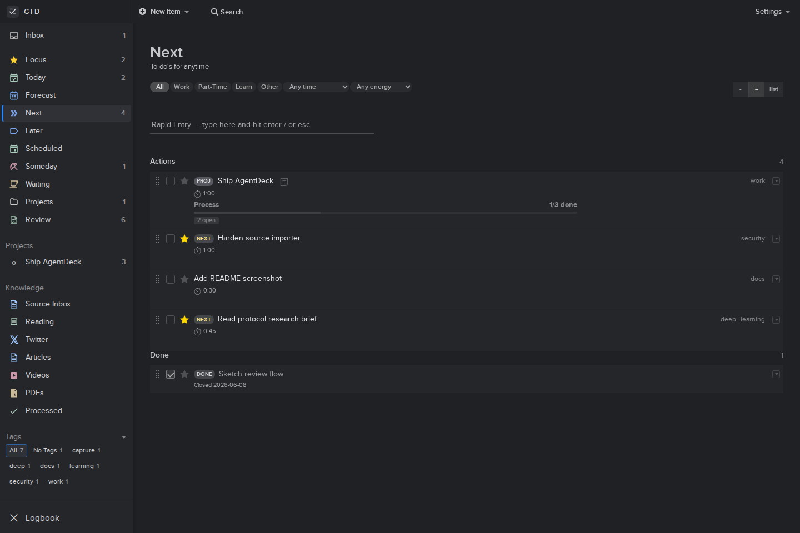

# AgentDeck

AI-native GTD and source-to-action workflow for crypto builders.

AgentDeck is a small SQLite-first web app for managing actions, projects, review, forecast planning, and research sources such as Twitter/X threads, articles, PDFs, YouTube links, and GitHub/doc links.



## Storage Model

SQLite is the primary store.

Org files are compatibility boundaries:

- Org import runs only when the SQLite database is empty.
- Org export is used as backup/interchange text.
- The app does not treat `current.org` as the live source of truth after import.

Default paths:

- database: `data/gtd.sqlite`
- Org import seed: `~/org/gtd/current.org` and `~/org/gtd/archive.org`
- Org export backup: `~/org/gtd/agentdeck-export.org`

## Development

```sh
npm ci
npm test
npm run test:e2e
npm start
```

The server defaults to `127.0.0.1:8787`.

Useful environment variables:

```sh
GTD_HOST=127.0.0.1
GTD_PORT=8787
GTD_DB_FILE=/absolute/path/to/gtd.sqlite
GTD_CURRENT_FILE=/absolute/path/to/current.org
GTD_ARCHIVE_FILE=/absolute/path/to/archive.org
GTD_EXPORT_FILE=/absolute/path/to/agentdeck-export.org
GTD_AUTO_EXPORT=1
GTD_REQUIRE_AUTH=1
GTD_BASIC_USER=bytenoob
GTD_BASIC_PASSWORD_FILE=/absolute/path/to/data/basic-password
GTD_ALLOW_PRIVATE_FETCH=0
```

## Deployment

This repo is currently deployed behind nginx at:

```text
https://gtd.bytenoob.io
```

The production service runs with systemd. Database files and generated auth secrets under `data/` are intentionally ignored by git and should be backed up separately.

When `GTD_REQUIRE_AUTH=1` is enabled, the app uses HTTP Basic auth for all routes. If `GTD_BASIC_PASSWORD_FILE` points at a missing file, AgentDeck creates a random password there with `0600` permissions on startup.

Authenticated production smoke check:

```sh
curl -fsS -u "bytenoob:$(cat /home/bytenoob/agentdeck/data/basic-password)" http://127.0.0.1:8787/api/state
```

## Testing

Run both test suites before shipping UI or data-model changes:

```sh
npm test
npm run test:e2e
```

The E2E suite starts an isolated temporary server and database; it does not mutate production data.
